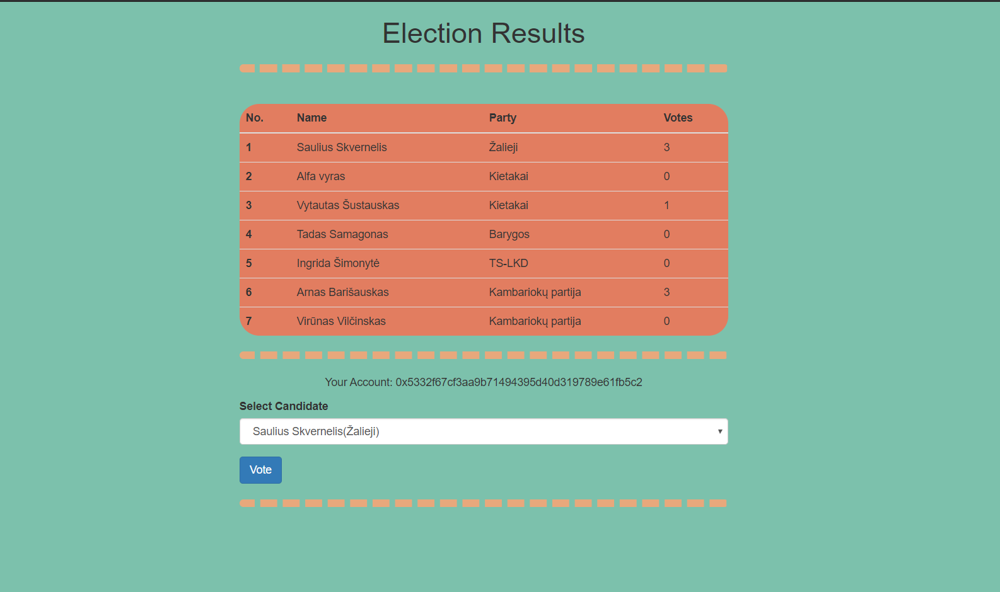
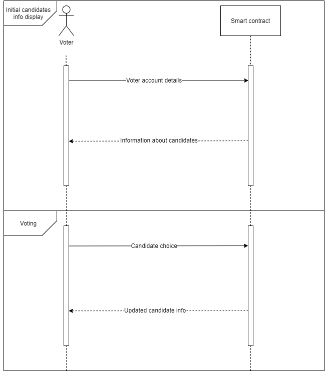
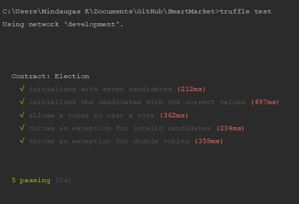

# SmartElection
- 
---
## Link to the requirements of the task
[SmartContract](https://github.com/blockchain-group/Blockchain-technologijos/blob/master/pratybos/4uzduotis-SmartContract.md)
## Install instructions
1. install **Node.js**, **Truffle**, **Ganache**
2. clone repository ```$ git clone https://github.com/gitguuddd/SmartElect.git``` or ```$ git clone git@github.com:gitguuddd/SmartElect.git``` if you're using SSH
3. cd to ```SmartElect``` main directory
4. run ```npm install``` to install required packages
5. start Ganache server, connect to Ganache localhost test pool in your browser
6. type ```npm run dev``` to run client
7. go to ```http://localhost:3000/```
---
## Goal
The goal of this project is to create a voting system which uses solutions provided by Ethereum smart contracts to ensure normal voting functionality (protection against double voting). The users of this system use their Ethereum accounts to vote for candidates. The voting is mostly free (voters still have to pay the transaction gas fee). Once the voter has voted the smart contract is updated to prevent double voting. After each vote and event is emitted which loads the latest results. The results table can be sorted by candidates' **name**, **party**, **vote count**.

---
## SmartElect sequence diagram


- Initial candidates info display
    - Voter sends his MetaMask account info to smart contract
    - Smart contract sends back the initial information about candidates
- Voting
    - Voter sends his candidate choice to smart contract
    - Smart contract returns back updated information about candidates

---
## Tests
SmartElect uses 5 distinct tests to ensure that the smart contract work as intended before deploying it (and paying for the transaction):
- Candidates initialization test - checks if a correct number of candidates has been constructed on deployment
- Correct candidate info test - checks if the candidates were initialised with the correct info
- Vote casting test - checks if a voter is able to vote.
- Invalid candidate exception handling test - checks if the smart contract is able to handle cases when invalid candidate id is passed via voting.
- Double vote exception handling test - checks if the smart contract is able to prevent double voting.



---
## Log


---
## Changelog

[v1.0](https://github.com/gitguuddd/SmartElection/releases/tag/v0.1) - (2019-12-29)
**Added**
- Files required for full functionality

**Changed**
- README

---
(2019-12-20)

**Added**
- Initial files
- README
